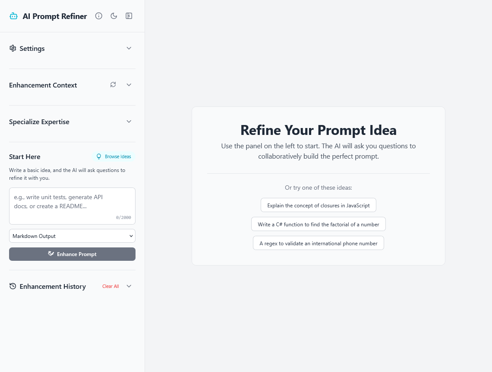

<div align="center">
  <h1>AI Prompt Refiner</h1>
  <p>
    A smart web application that uses a conversational AI to help you transform basic ideas into detailed, effective, and ready-to-use prompts.
  </p>
  <p>
    <a href="https://github.com/ersinkoc/ai-prompt-refiner/blob/main/LICENSE">
      
    </a>
    <a href="https://github.com/ersinkoc/ai-prompt-refiner">
      
    </a>
  </p>
</div>

---



The **AI Prompt Refiner** is a tool designed to bridge the gap between a simple idea and a high-quality, well-structured AI prompt. Instead of guessing what an AI needs, this application uses Google's Gemini model to engage you in a conversation, asking clarifying questions to collaboratively build the perfect prompt for your task.

## ✨ Key Features

*   **🤖 Conversational Refinement:** The AI asks you targeted questions to understand your goal.
*   **🔧 Tech Stack Specialization:** Focus the AI's expertise on specific technologies (e.g., React, Python, Docker) for more relevant results.
*   **💾 Local History:** Your completed prompt refinements are automatically saved in your browser for future reference.
*   **💡 Examples & Templates:** Get started quickly by browsing a built-in library of prompt ideas and templates.
*   **⚙️ Customizable Output:** Choose your desired output format (Markdown, JSON, or Plain Text).
*   **🌓 Light & Dark Mode:** A comfortable viewing experience in any lighting condition.
*   ** tour:** An interactive guided tour to get you started.

## 🚀 Getting Started

Follow these instructions to set up and run the project on your local machine for development and testing purposes.

### Prerequisites

*   [Node.js](https://nodejs.org/) (v18 or later recommended)
*   `npm` or a compatible package manager
*   A [Google Gemini API Key](https://ai.google.dev/gemini-api/docs/api-key)

### Installation & Setup

1.  **Clone the repository:**
    ```bash
    git clone https://github.com/ersinkoc/ai-prompt-refiner.git
    cd ai-prompt-refiner
    ```

2.  **Install dependencies:**
    ```bash
    npm install
    ```

3.  **Configure your API Key:**
    Create a new file named `.env.local` in the root of the project and add your Gemini API key to it:
    ```env
    GEMINI_API_KEY="YOUR_API_KEY_HERE"
    ```
    This file is ignored by Git, so your key will remain private.

4.  **Run the application:**
    ```bash
    npm run dev
    ```
    The application will be available at `http://localhost:3000`.

## 📜 Available Scripts

In the project directory, you can run:

*   `npm run dev`: Runs the app in development mode.
*   `npm run build`: Builds the app for production to the `dist` folder.
*   `npm run preview`: Serves the production build locally to preview it.

## 🤝 Contributing

Contributions, issues, and feature requests are welcome! Feel free to check the [issues page](https://github.com/ersinkoc/ai-prompt-refiner/issues).

## 📄 License

This project is licensed under the MIT License - see the [LICENSE](https://github.com/ersinkoc/ai-prompt-refiner/blob/main/LICENSE) file for details.